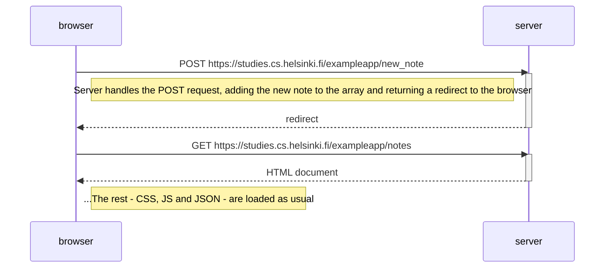

```mermaid
sequenceDiagram
	participant browser
	participant server
	
	browser->>server: POST https://studies.cs.helsinki.fi/exampleapp/new_note
	activate server
	
	Note right of browser: Server handles the POST request, adding the new note to the array and returning a redirect to the browser
	
	server-->>browser: redirect
	deactivate server
	
	browser->>server: GET https://studies.cs.helsinki.fi/exampleapp/notes
	activate server
	server-->>browser: HTML document
	deactivate server
	
	Note right of browser: ...The rest - CSS, JS and JSON - are loaded as usual
```
